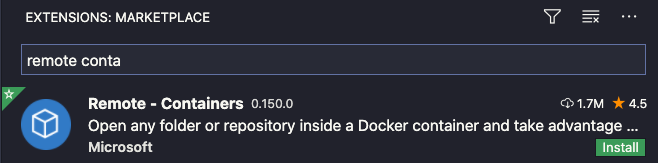
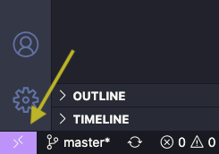
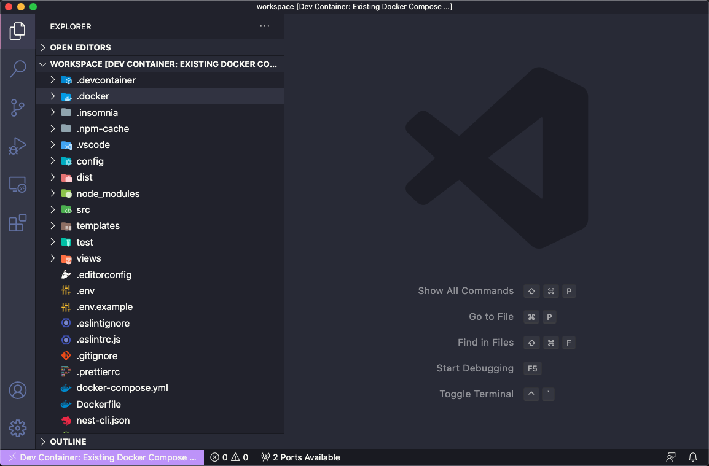
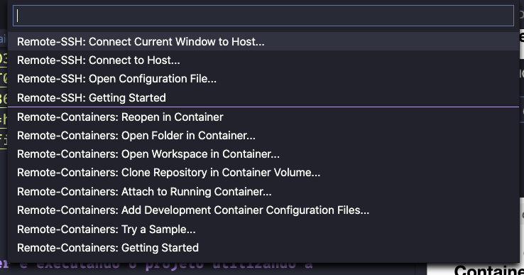

## Iniciando o projeto dentro do container

### Utilizar o VSCode

#### Clone o repositório na pasta desejada e abra no vscode.

```bash
# Clonando o repositório na pasta customer-api.
$ git clone https://github.com/joaobezerradev/customer-api.git customer-api

# Copie e preencha as variaves de ambiente.
$ cd customer-api && cp .env.example .env

# Abrindo o vscode na pasta customer-api
$ code .
```

#### Instale a extensão Remote - Containers



`Reinicie o vscode`

#### Criando o container docker e executando o projeto utilizando a extensão "Remote - Containers".

`Com a extensão instalada clique no icone no canto inferior esquerdo.`



`Escolha a opção : Remote-Containers: Reopen in Container`



`O docker irá executar o ambiente configurado no docker-compose (na raiz do projeto) e dockerfile que se encontra no diretório .docker/app/`

`Esse procedimento pode demorar um pouco mais na primeira execução, pois o docker irá baixar as imagens de dependência e executar o build do container`



`Pronto ambiente criado com sucesso. 😎`

`Agora basta baixar as dependencias executando no terminal do vscode (que já está no contexto do container) usando o comando:`

```bash
$ npm ci
```

#### Executando

```bash
# development
$ npm run start:dev
```

- URL Swagger - http://localhost:3333/api
- API acessível em http://localhost:3333

## Test

```bash
# tests
$ npm test

# test coverage
$ npm run test:cov
```
